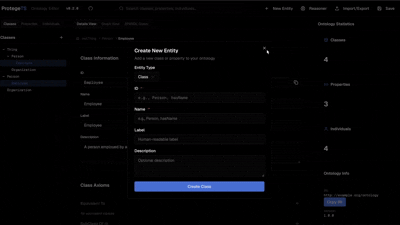

# Modern Ontology Editor

A next-generation, web-based ontology engineering platform built with TypeScript, React, and AI assistance.

[](https://github.com/aadorian/ProtegeDesk/actions)
[](https://opensource.org/licenses/MIT)
[](https://www.typescriptlang.org/)
[](https://reactjs.org/)

---



---

## 🚀 Features

### Core Ontology Engineering

- ✨ **Advanced Axiom Editor** with CodeMirror-powered Manchester Syntax editing
- 🌳 **Hierarchical Visualization** with automatic layout and incremental loading
- 📁 **Multiple Format Support** (Turtle, RDF/XML, OWL/XML, N-Triples)
- 🔍 **Intelligent Autocomplete** with context-aware suggestions
- ✅ **Real-time Validation** and syntax checking

### AI-Powered Assistance

- 🤖 **Ontology Generation** from natural language descriptions
- 💡 **Smart Property Recommendations** based on class context
- 📝 **Axiom Generation** from constraints described in plain English
- 🎯 **Context-Aware Suggestions** throughout the workflow

### Reasoning & Validation

- 🧠 **Client-Side Reasoning** (WebAssembly) for instant feedback
- 🔧 **Inconsistency Detection** with detailed explanations
- 🛠️ **Automated Repair Wizard** for fixing logical errors
- 📊 **Inference Visualization** showing derived knowledge

### User Experience

- 🎨 **Modern UI** with dark/light themes
- ⌨️ **Keyboard Shortcuts** for power users
- 🎯 **Command Palette** (⌘+K) for quick access
- 📱 **Responsive Design** for various screen sizes
- ♿ **Accessibility** (WCAG 2.1 Level AA)

---

## 🛠️ Technology Stack

- **Frontend**: Next.js 16, React 19, TypeScript 5
- **Styling**: Tailwind CSS, Shadcn/ui, Radix UI
- **State Management**: React Context API
- **Ontology Logic**: Custom HermiT-inspired reasoner
- **Testing**: Jest, React Testing Library, ts-jest
- **Form Handling**: React Hook Form, Zod
- **Charts**: Recharts
- **Icons**: Lucide React

---

## 📦 Installation

### Prerequisites

- Node.js 18+ and npm 9+
- Modern browser (Chrome 86+, Firefox 82+, Safari 14+, Edge 86+)

### Quick Start

```bash
# Clone the repository
git clone https://github.com/aadorian/ProtegeDesk.git
cd ProtegeDesk

# Install dependencies
npm install

# Run development server
npm run dev

# Open http://localhost:3000
```

### Build for Production

```bash
# Create production build
npm run build

# Start production server
npm start
```

---

## 🚦 Getting Started

### Creating Your First Ontology

1. **Open the application** in your browser
2. **Click "New Ontology"** or press `Ctrl+N`
3. **Enter basic information**:
   - Name: "MyOntology"
   - Base IRI: "http://example.org/myontology#"
4. **Start adding classes**:
   - Right-click in the class tree
   - Select "Add Class"
   - Enter class name (e.g., "Person")
5. **Define properties**:
   - Select your class
   - Click "Add Property" in the properties panel
   - Choose Object Property or Data Property
6. **Use AI assistance** (optional):
   - Press `⌘+K` (or `Ctrl+K`)
   - Type "Generate ontology structure"
   - Describe your domain
   - Review and accept suggestions

### Importing Existing Ontologies

```bash
# Supported formats:
- Turtle (.ttl)
- RDF/XML (.rdf, .owl)
- OWL/XML (.owl)
- N-Triples (.nt)
```

1. Click **"Import"** or press `Ctrl+O`
2. Select your ontology file
3. Wait for parsing (progress shown for large files)
4. Review import summary
5. Start editing!

---

## 📚 Documentation

- [User Guide](https://github.com/aadorian/ProtegeDesk/wiki/User-Guide) - Complete user documentation
- [Tutorial](https://github.com/aadorian/ProtegeDesk/wiki/Tutorial) - Step-by-step learning path
- [API Reference](https://github.com/aadorian/ProtegeDesk/wiki/API-Reference) - Developer documentation
- [Architecture](https://github.com/aadorian/ProtegeDesk/wiki/Architecture) - System design and structure
- [Contributing](CONTRIBUTING.md) - How to contribute
- [FAQ](https://github.com/aadorian/ProtegeDesk/wiki/FAQ.md)- Frequently asked questions

---

## 🎯 Project Status

### Current Version: 0.2.0 (MVP Development)

**Development Progress**:

- [x] Sprint 0: Project Setup ✅
- [ ] Sprint 1: Core Infrastructure (In Progress)
- [ ] Sprint 2: Ontology Management
- [ ] Sprint 3: Axiom Editor
- [ ] Sprint 4: Graph Visualization
- [ ] Sprint 5-12: Advanced Features

See [Project Board](https://github.com/aadorian/ProtegeDesk/projects/1) for detailed progress.

### Roadmap

**Version 1.0** (6 months)

- Complete ontology editing capabilities
- AI-assisted development
- Client-side reasoning
- Visualization with incremental loading

**Version 2.0** (Future)

- Real-time collaboration
- Version control integration
- Mobile applications
- Advanced reasoning features
- Plugin system

---

## 🤝 Contributing

We welcome contributions! Please see [CONTRIBUTING.md](CONTRIBUTING.md) for details.

### Quick Contribution Guide

1. **Fork the repository**
2. **Create a feature branch**: `git checkout -b feature/amazing-feature`
3. **Make your changes** and commit: `git commit -m 'Add amazing feature'`
4. **Push to the branch**: `git push origin feature/amazing-feature`
5. **Open a Pull Request**

### Development Workflow

```bash
# Install dependencies
npm install

# Run development server
npm run dev

# Run tests
npm test

# Run linting
npm run lint

# Run type checking
npm run type-check

# Run all checks before committing
npm run validate
```

---

## 🧪 Testing

Logic-focused unit testing with Jest and TypeScript. Tests concentrate on business logic, algorithms, and data transformations.

### Running Tests

```bash
npm test              # Run all tests
npm run test:watch    # Watch mode
npm run test:coverage # With coverage
npm run test:ci       # CI mode
```

### Test Results

- **130 tests** passing in ~1.3 seconds
- **6 test suites** covering core logic modules
- **95%+** coverage on tested modules

### What's Tested

- ⚙️ **Ontology reasoning** - Consistency, inference, validation
- 🔄 **Data serialization** - JSON-LD, Turtle, OWL/XML
- 📊 **State management** - Context operations, CRUD
- 🏗️ **Data generation** - Sample data, validation
- 🪝 **React hooks** - Toast management, lifecycle
- 🛠️ **Utilities** - Helper functions

### Example

```typescript
describe('HermiTReasoner', () => {
  it('should detect circular dependencies', () => {
    const ontology = createOntologyWithCircularRefs()
    const reasoner = new HermiTReasoner(ontology)
    const result = reasoner.reason()

    expect(result.errors).toContainEqual(expect.objectContaining({ type: 'circular' }))
  })
})
```

See [TESTING.md](TESTING.md) for detailed documentation.

---

## 📋 Available Scripts

| Script                  | Description                                  |
| ----------------------- | -------------------------------------------- |
| `npm run dev`           | Start development server                     |
| `npm run build`         | Create production build                      |
| `npm start`             | Start production server                      |
| `npm test`              | Run unit tests                               |
| `npm run test:watch`    | Run tests in watch mode                      |
| `npm run test:coverage` | Run tests with coverage report               |
| `npm run test:ci`       | Run tests in CI mode                         |
| `npm run lint`          | Run ESLint                                   |
| `npm run lint:fix`      | Auto-fix linting issues                      |
| `npm run format`        | Format code with Prettier                    |
| `npm run type-check`    | Run TypeScript type checking                 |
| `npm run validate`      | Run all checks (type + lint + format + test) |

---

## 🎨 Code Quality & Linting

Professional code quality setup with ESLint 9 and Prettier.

### Quick Commands

```bash
npm run lint        # Check for issues
npm run lint:fix    # Auto-fix issues
npm run format      # Format code
npm run validate    # Run all checks
```

### Features

- ✅ **ESLint 9** with flat config format
- ✅ **TypeScript** strict rules
- ✅ **React** and hooks enforcement
- ✅ **Prettier** with Tailwind CSS class sorting
- ✅ **Accessibility** rules (jsx-a11y)
- ✅ **Auto-fix** for most issues
- ✅ **Magic-number warnings** for constants outside of lib/constants.ts

### Configuration

- [eslint.config.mjs](eslint.config.mjs) - ESLint configuration
- [.prettierrc](.prettierrc) - Prettier formatting rules
- [LINTING.md](LINTING.md) - Complete documentation

See [LINTING.md](LINTING.md) for detailed configuration and IDE setup.

---

## 🐛 Bug Reports & Feature Requests

Found a bug or have a feature request? Please open an issue!

- [Report a Bug](https://github.com/aadorian/ProtegeDesk/issues/new?template=bug_report.md)
- [Request a Feature](https://github.com/aadorian/ProtegeDesk/issues/new?template=feature_request.md)

---

## 📄 License

This project is licensed under the MIT License - see the [LICENSE](LICENSE) file for details.

---

## 👥 Contributors

- **Ale** - [@aadorian](https://github.com/aadorian) - Project Lead & Core Developer
  - Project architecture and leadership
  - Cursor AI development environment configuration
  - Comprehensive development guidelines documentation
  - Hydration error fixes and core improvements
  - Fixed individuals tab runtime error
  - Removed Vercel Analytics component to prevent script loading errors

- **ParthP511** - [@ParthP511](https://github.com/ParthP511)
  - Comprehensive inline documentation comments
  - Documented reasoning logic in core modules
  - URL copy functionality with toast notifications
  - Header component testing
  - Modal dialogs for selected graph nodes (class, property, individual details)
  - Copy to clipboard hook implementation
  - ESLint magic numbers rule enforcement
  - Test suite fixes for file parsing issues
  - Success and failure message notifications for operations

- **charulata871** - [@charulata871](https://github.com/charulata871)
  - Code refactoring and improved variable naming
  - ClassDetails component refactoring
  - Enhanced code quality and maintainability
  - Debug logging implementation
  - Type safety improvements with explicit return type annotations
  - Troubleshooting documentation for common setup issues

- **SIVA** - [@NANI-31](https://github.com/NANI-31)
  - Enhanced graph visualization with zoom controls
  - Drag-and-drop file import implementation
  - Breadcrumb navigation implementation
  - Copy IRI button for entity cards
  - Class tree search functionality

- **mostafakm78** - [@mostafakm78](https://github.com/mostafakm78)
  - Performance optimization with component memoization
  - Ontology list item component improvements

- **sojukrishna** - [@sojukrishna](https://github.com/sojukrishna)
  - Input validation for IRI format in NewEntityDialog

- **Anoop-2024si96509** - [@Anoop-2024si96509](https://github.com/Anoop-2024si96509)
  - Inline code comments for complex algorithms

- **Vineeth Wilson** - [@VineethWilson](https://github.com/VineethWilson)
  - Last modified timestamp tracking for statistics

- **Tim** - [@TimmyByDay](https://github.com/TimmyByDay)
  - Comprehensive JSDoc documentation for utility functions

- **EvanPerezJ** - [@EvanPerezJ](https://github.com/EvanPerezJ)
  - Expand/collapse toggle for class tree

- **Ronit Reddy** - [@ronitvoila](https://github.com/ronitvoila)
  - Inverse property selection UI implementation

- **Umer Jahangir** - [@Umer-Jahangir](https://github.com/Umer-Jahangir)
  - Console.log cleanup for production components

See [CONTRIBUTORS.md](CONTRIBUTORS.md) for the complete list and detailed contribution information.

---

## 🙏 Acknowledgments

- [Protege](https://protege.stanford.edu/) - Inspiration for ontology editing
- [CodeMirror](https://codemirror.net/) - Code editing
- [React Flow](https://reactflow.dev/) - Graph visualization
- [N3.js](https://github.com/rdfjs/N3.js) - RDF parsing
- [Vercel](https://vercel.com/) - Deployment platform
- [Shadcn/ui](https://ui.shadcn.com/) - UI components

---

## 📧 Contact

- **Project Lead**: [your.email@example.com]
- **Documentation**: [docs.example.com]
- **Community**: [Discord/Slack invite link]
- **Twitter**: [@ontology_editor]

---

## ⭐ Star History

If you find this project useful, please consider giving it a star! ⭐

[](https://star-history.com/#aadorian/ProtegeDesk&Date)

---

**Made with ❤️ by the Modern Ontology Editor Team**
